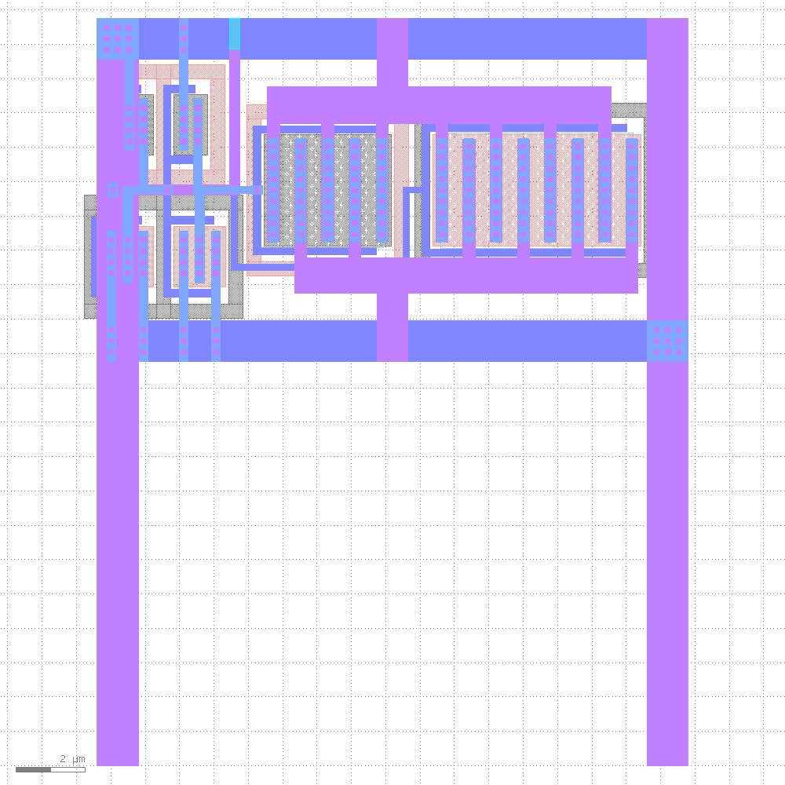
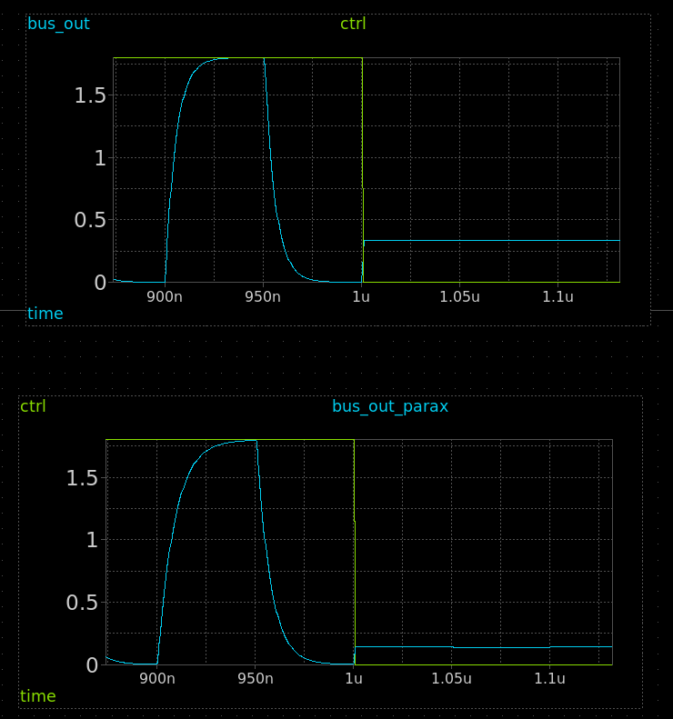
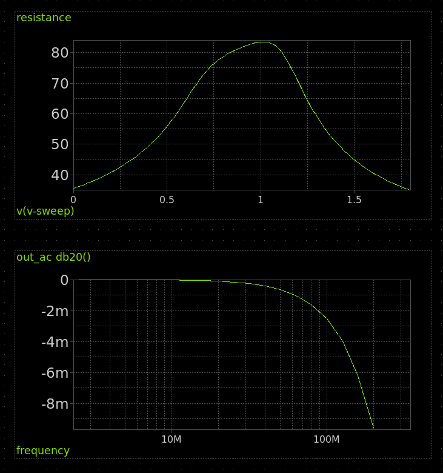

# Analog switch for TT06

[schematic](https://xschem-viewer.com/?file=https://github.com/TinyTapeout/tt_asw_1v8/blob/main/xschem/tt_asw_1v8.sch)

# Layout

# Simulations

## Schematic vs Layout

## Resistance and AC

